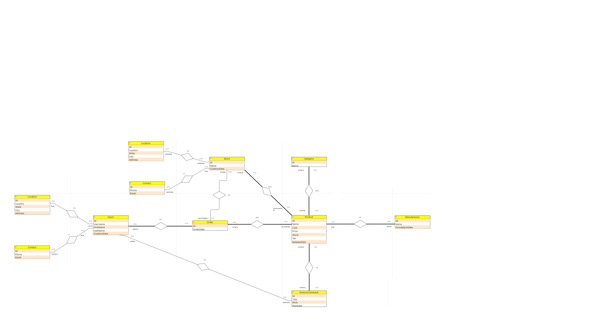

## Diagrama Entidad Relacción

___

## Esquema Lógico

**Mapa**:
<u>Primary Key</u>
*Foreign Key*
<em><u>PK y FK a la vez</u></em>

**Product**: <u>Id</u>, Name, Cost, Price, Stock, Tax, ReleaseDate(Date), *ManufacturerId*
**Manufacturer**: <u>Id</u>, Name, FoundationDate(Date), *LocationId*, *ContactId*
**Category**: <u>Id</u>, Name
**CategoryProduct**: <em><u>IdProduct, IdCategory</u></em>
**Comment**: <u>Id</u>, Title, Body, PostDate(TimeStamp), *ProductId*, *ClientId*
**Store**: <u>Id</u>, Name, CreationDate(Date), *LocationId*, *ContactId*
**ProductStore**: <em><u>IdProduct</u></em>,<em><u>IdStore</u></em>
**Order**: <u>Id</u>, OrderDate(TimeStamp), *ClientId*, *StoreId*
**Client**: <u>Id</u>, Username, FirstName, LastName, CreationDate(TimeStamp), *LocationId*, *ContactId*
**Location**: <u>Id</u>, Country, State?, City, Address
**Contact**: <u>Id</u>, Phone, Mail
___

## Modelos C\#/.NET

**Product**
* Id
* Name
* Cost
* Price
* Stock
* Tax
* ReseaseDate (Date)
	* `Relationship`
* Manufacturer
* List\<Store> Stores
* List\<Category\> Categories
	* `FK`
* ManufacturerId

**Manufacturer**
* Id
* Name
* FoundationDate (Date)
	* `Relationships`
* Location
* Contact
* List\<Product\> Products [IgnoreJson]
	* `FKs`
* LocationId
* ContactId

**Category**
* Id
* Name
	* `Relationships`
* List\<Product\> Products [IgnoreJson]

**Comment**
* Id
* Title: string
* Body: longText
* PostDate  (TimeStamp)
	* `Relationships`
* Product [IgnoreJson]
* Client [IgnoreJson]
	* `FKs`
*  ProductId
* ClientId

**Store**
* Id
* Name
* CreationDate (Date)
	* `Relationships`
* Location
* Contact
* List\<Product\> Products [IgnoreJson]
	* `FKs`
* LocationId
* ContactId

**Order**
* Id
* OrderDate (DateTime)
	* `Relationships`
* Client
* Store
	* `FKs`
* ClientId
* StoreId

**Client**
* Id
* Username
* FirstName
* LastName
* CreationDate (DateTime)
	* `Relationships`
* Location
* Contact
	* `FKs`
 * LocationId
 * ContactId

**Location**
* Id
* Country
* State? (Nullable)
* City
* Address

**Contact** 
* Id
* Phone
* Mail
